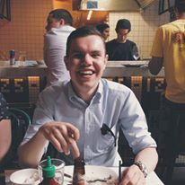

Hello. My name is Adam, I'm an aspiring software engineer based in Melbourne, Australia. Recently I completed a BCS degree at Swinburne University of Technology. I have a passion for all things computing, particularly open source software development. Outside of computer science, I enjoy traveling, literature, motor mechanics, and am an avid Chelsea FC supporter.
 
 
You may come across me on a myriad of usually tech based communities under some variation of Foxhound.

[Twitter](https://twitter.com/adammiritis)
[GitHub](https://github.com/Foxh0und)
[Stack Overflow](https://stackoverflow.com/users/5353034/foxhound)
[LinkedIn](https://www.linkedin.com/in/adam-miritis-006938a7/)
